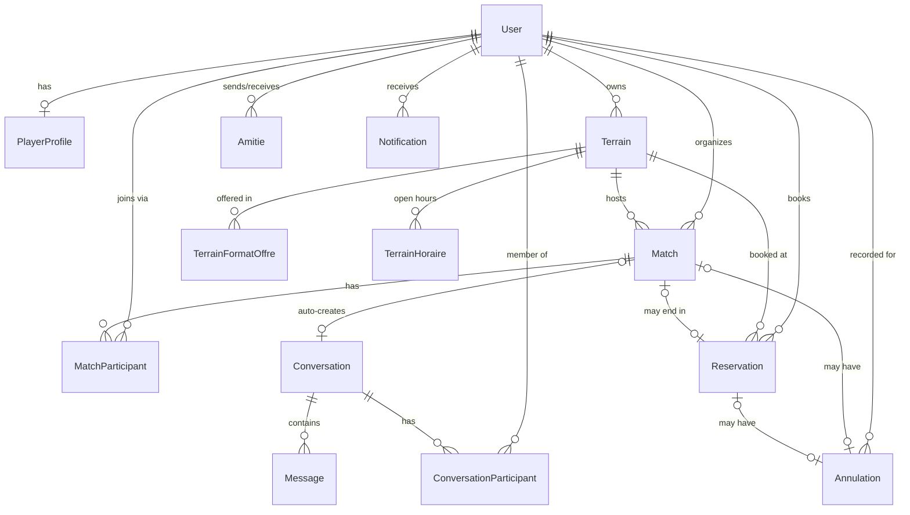

# Takwria TN — Architecture Reference

> **Purpose of this file:** a from-scratch orientation to the whole project — what it
> is, who uses it, how the code is laid out, how the pieces talk to each other, and
> where things stood as of **2026-08-28**. Written so you can drop back into the
> project after time away without re-reading the whole codebase.
>
> The product-level French vision doc is [`plan.md`](../plan.md) (root of the repo) —
> read that first if you want the "why", this file is the "how".

---

## 1. What this is

**Takwria TN** ("Find your pitch. Form your team. Play your match.") is a football
(5-a-side to 11-a-side) pitch-booking and pickup-match platform for Tunisia. A player
searches pitches by city/date/time, books a slot directly, or creates/joins an open
match that auto-fills a group chat with its participants. Pitch owners list and manage
their own venues; an admin moderates everything.

- **Stack:** Next.js 15 (App Router, React 19, TypeScript), NextAuth v4 (JWT sessions,
  credentials provider), Prisma 5 + PostgreSQL, Tailwind CSS, Zod for validation,
  Vitest + Testing Library for tests, Resend for transactional email.
- **Language:** all UI copy, route names, DB fields, and code identifiers are in
  **French** (`matchs`, `terrains`, `joueurs`, `annuler`, `rejoindre`...). This
  document uses French identifiers verbatim when naming real code, English for
  everything else.
- **Timezone:** the whole app assumes the Node process starts with `TZ=Africa/Tunis`
  set at the OS level (see `README.md`) — slot generation and "is this in the past"
  checks depend on it.

---

## 2. Actors (who uses the platform)

The database has **3 account roles** (`Role` enum in `prisma/schema.prisma`):

| Role (DB) | French label | What they can do |
|---|---|---|
| `joueur` | Joueur (player) | Sign up, browse/search pitches, book a slot directly, browse/search other players, create or join matches, friend other players, chat, manage own profile |
| `proprietaire` | Propriétaire (pitch owner) | Everything a `joueur` can do, **plus** list and manage their own pitches (CRUD), formats/pricing per pitch, opening hours |
| `administrateur` | Administrateur (admin) | Moderate: manage all players, all pitch owners, all pitches (activate/suspend), cancel any match with a reason, view the sitewide cancellation history |

A 4th role from the original product vision (`plan.md`) — **"Organisateur"** — is
**not** a separate account type. Any `joueur` who creates a match becomes that
match's organizer (`Match.organisateurId`); the privilege is scoped to that one
match, not a sitewide role.

Signup (`POST /api/inscription`) lets a user opt into `proprietaire` via an
`estProprietaire` checkbox — the role is **derived server-side** from that flag, never
trusted from the client body directly. `administrateur` cannot be self-assigned; it's
granted via the `promouvoir-admin` CLI script (`scripts/promouvoir-admin`, wave-2
admin sub-project).

---

## 3. Data model

Source of truth: [`prisma/schema.prisma`](../prisma/schema.prisma). One Postgres
database, no read replicas, no external services except Resend (email) and (in the
in-flight pitch-owner sub-project) nothing else new.



### Key models

- **`User`** — `email`, `passwordHash` (bcrypt), `role`, `sessionVersion` (bumped on
  password reset to invalidate JWTs server-side — see §6).
- **`PlayerProfile`** — 1:1 with `User`. `prenom`, `ville`, `poste`, `niveau`,
  `piedPrefere`, `telephone`, `photoUrl`, `bio`. Note: **owners have no equivalent
  profile model** — a `proprietaire` `User` has nothing editable beyond email/role
  (a deliberate scope ruling from the wave-2 admin plan).
- **`Terrain`** (pitch) — `type` (gazon_synthetique / gazon_naturel / beton),
  `dureeCreneauMinutes` (slot length), `statut` (actif / en_attente / suspendu),
  `ownerId` nullable (null = demo seed data, not yet owner-managed).
  - **`TerrainFormatOffre`** — a pitch can be offered in multiple formats (5v5, 7v7,
    11v11...), each with its own `capacite` and `prixParCreneau` (price **in
    millimes**, 1 TND = 1000 millimes — see `src/lib/terrains/format.ts:formatPrix`).
  - **`TerrainHoraire`** — opening hours per day-of-week (`0`=Sunday...`6`=Saturday,
    matching `Date.getDay()`).
- **`Match`** — `date`/`heureDebut`/`heureFin` as local-time strings (not UTC
  `DateTime`, deliberately — see `src/lib/reservations/queries.ts`'s
  `versDateLocale`), `format`, `joueursMax`, `organisateurParticipe` (does the
  organizer count toward the headcount), `statut` (ouvert/complet/annule),
  `conversationId` (auto-created group chat), `reservationId` +
  `decisionReservationAt` (end-of-match booking decision, see §5.3).
- **`Reservation`** — direct pitch bookings. Can also be the byproduct of a match's
  end-of-match booking decision (`Match.reservationId` points back to it).
- **`Annulation`** — a **unified cancellation record** for either a `Match` or a
  `Reservation` (exactly one of `matchId`/`reservationId` is set — enforced by
  convention/tests, not a DB CHECK constraint Prisma can express). Single source
  for both the admin's and the owner's "cancellation history" views.
- **`Amitie`** (friendship), **`Conversation`/`Message`/`ConversationParticipant`**
  (messaging — 1:1 or match group chats), **`Notification`** — supporting social
  features.

### Migrations

Ten migrations under `prisma/migrations/`, applied in order; the two most recent
(`wave2_foundation`, `add_match_decision_reservation`) back the current in-flight
work. `npm run db:migrate` (dev) / `db:migrate:deploy` (CI/prod) / `db:migrate:test`
(test DB on port 5433, see docker-compose.yml).

---

## 4. Application structure (`src/`)

```
src/
├── app/                    # Next.js App Router — pages + API routes
│   ├── page.tsx            # Homepage
│   ├── connexion/, inscription/, mot-de-passe-oublie/, reinitialiser-mot-de-passe/[token]/
│   ├── profil/              # Own profile (edit)
│   ├── tableau-de-bord/     # Player dashboard (reservations, matches)
│   ├── terrains/, terrains/[id]/           # Pitch search + detail
│   ├── matchs/, matchs/[id]/, matchs/creer/ # Match search + detail + create
│   ├── joueurs/, joueurs/[id]/             # Player search + public profile
│   ├── amis/, amis/[id]/                   # Friends list + conversation thread
│   └── api/                 # Route handlers — one folder per resource (see §4.1)
├── components/               # React components, grouped by feature folder
│   ├── forms/, nav/, providers/, ui/
│   └── amis/, joueurs/, matchs/, messages/, reservations/, terrains/, auth/
├── lib/                      # All business logic — the real "backend"
│   ├── auth.ts, auth/authorization.ts    # NextAuth config + role-gate helper
│   ├── prisma.ts, env.ts, mailer.ts, password.ts, resetToken.ts, rateLimit.ts
│   ├── api/                 # parseJsonBody, searchParams normalization helpers
│   ├── validation/           # One Zod schema file per domain (auth, match, terrain, ...)
│   └── <domain>/queries.ts   # One file per domain: amis, joueurs, matchs, messages,
│                              #   notifications, reservations, terrains, annulations
├── middleware.ts             # Route-level auth gate (see §6)
└── types/next-auth.d.ts      # Session/JWT type augmentation
```

**Pattern:** pages and API routes are thin. All real logic — queries, mutations,
authorization checks, concurrency control — lives in `src/lib/<domain>/queries.ts`,
unit-tested directly against a real Postgres test database (not mocked). Route
handlers just: get the session → validate the body with a Zod schema from
`src/lib/validation/` → call the `lib` function → map its typed result to an HTTP
status. This mapping-a-typed-result-to-status pattern repeats everywhere (see the
`reponses` lookup table in `src/app/api/matchs/[id]/reservation/route.ts` as a
representative example).

### 4.1 API routes (`src/app/api/`)

| Route | Purpose |
|---|---|
| `POST /api/inscription` | Signup (creates `User` + `PlayerProfile`, derives role from `estProprietaire`) |
| `[...nextauth]` | NextAuth credentials login/session/logout |
| `POST /api/mot-de-passe-oublie` | Request password reset (always 200, rate-limited, no account-existence leak) |
| `POST /api/reinitialiser-mot-de-passe` | Consume reset token, set new password, bump `sessionVersion` |
| `GET/PUT /api/profil` | Read/update own profile |
| `GET /api/terrains`, `GET /api/terrains/[id]` | Pitch search / detail |
| `GET/POST /api/terrains/[id]/reservations` | Slots for a pitch / book a slot |
| `POST /api/reservations/[id]/annuler` | Cancel a direct reservation (requires reason) |
| `GET/POST /api/matchs` | Match search / create |
| `POST /api/matchs/[id]/rejoindre` | Join an open match |
| `POST /api/matchs/[id]/quitter` | Leave a match |
| `POST /api/matchs/[id]/annuler` | Organizer cancels a match (requires reason) |
| `POST /api/matchs/[id]/reservation` | **End-of-match booking decision** (organizer only, see §5.3) |
| `GET/POST /api/amis`, `POST /api/amis/[id]/accepter`, `POST /api/amis/[id]/refuser` | Friend requests |
| `GET/POST /api/messages/[userId]` | 1:1 conversation thread |

| `GET/POST /api/proprietaire/terrains`, `PATCH/DELETE /api/proprietaire/terrains/[id]` | Pitch owner: terrain CRUD |
| `POST/PATCH/DELETE /api/proprietaire/terrains/[id]/formats[/[formatId]]` | Pitch owner: manage format/price offers on a terrain |
| `PUT /api/proprietaire/terrains/[id]/horaires` | Pitch owner: update opening hours |
| `GET/PUT/DELETE /api/admin/joueurs/[id]`, `GET/DELETE /api/admin/proprietaires/[id]`, `PATCH/DELETE /api/admin/terrains/[id]`, `POST /api/admin/matchs/[id]/annuler` | Admin moderation |

All four route families above landed in the Wave 2 merge on 2026-08-28 (§8).

### 4.2 Pages

Every page under `terrains/`, `matchs/`, `joueurs/`, `amis/`, `profil/`,
`tableau-de-bord/`, `matchs/creer/` is a player-facing page. Bottom nav
(`src/components/nav/BottomNav.tsx`) is the primary mobile navigation: Accueil,
Terrains, Matchs, Joueurs, Profil (last one swaps to `/connexion` when logged out).

Two more page trees, each gated by `requireRole` (§6), landed in the Wave 2
merge (§8) and have **no entry in `BottomNav`** — reached only by URL or by a
role-appropriate link elsewhere (e.g. `/profil` linking a `proprietaire` to
their dashboard):

- **`/proprietaire/*`** — `proprietaire` role. Dashboard, terrains list, create
  (`/proprietaire/terrains/nouveau`), edit (`/proprietaire/terrains/[id]/modifier`,
  composed of `ModifierTerrainForm` + `FormatsManager` + `HorairesManager`).
- **`/admin/*`** — `administrateur` role. Dashboard, `joueurs`, `proprietaires`,
  `terrains`, `matchs`, `annulations` (list/detail + moderation actions), `profil`.

---

## 5. Notable domain logic

### 5.1 Slot generation (`src/lib/terrains/slots.ts`)

`generateSlots()` is pure and synchronous: given a pitch's weekly `horaires`, a
target `date`, `dureeCreneauMinutes`, and the set of already-`taken` start times, it
produces the day's bookable slots — filtering out past times (if the target day is
today), slots that would run past closing time, and deduplicating. `taken` comes
from `findTakenSlots`/`findTakenSlotsForTerrains`
(`src/lib/reservations/queries.ts`), which reads confirmed `Reservation` rows for
that pitch/date. This two-step split (pure slot math vs. DB-backed "what's taken")
is what makes slot generation unit-testable without a database.

### 5.2 Concurrency control — row locks, not optimistic checks

Every mutation in `src/lib/matchs/queries.ts` that can race with another request
against the *same match* (`rejoindreMatch`, `quitterMatch`, `annulerMatch`,
`deciderReservationMatch`) opens a `prisma.$transaction` and takes an explicit
Postgres row lock first:

```ts
await tx.$queryRaw`SELECT ... FROM "Match" WHERE id = ${matchId} FOR UPDATE`
```

This serializes concurrent requests against one match (e.g. two players both
hitting "join" on the last open slot) instead of relying on a check-then-write race
that a `SELECT` + `UPDATE` without a lock would allow. The pattern is applied
consistently — a design constraint documented inline in each function, and covered
by concurrency-specific tests (`tests/lib/matchs/queries.test.ts`).

### 5.3 End-of-match booking decision (newest feature, landed 2026-08-28)

When a match's `heureFin` has passed and the organizer hasn't yet decided,
`POST /api/matchs/[id]/reservation` lets them turn the match into a **real pitch
reservation** (or explicitly decline). `deciderReservationMatch`:
1. Locks the match row (`FOR UPDATE`, same pattern as above).
2. Rejects if: match not found, caller isn't the organizer, match already
   cancelled, match hasn't ended yet, or a decision was already recorded.
3. On "reserve": creates a `Reservation`, links it via `Match.reservationId`, checks
   for a slot conflict (`409`) exactly like a direct booking would.
4. Either way, stamps `Match.decisionReservationAt` so the UI prompt
   (`DecisionReservationMatch` component) never reappears once answered — without
   this field, a "no" answer would be indistinguishable from "not yet asked" and
   the prompt would nag forever.

Tests cover the exact end-of-slot time boundary and concurrent decision calls
(added same day, commit `9bfe98d`).

### 5.4 Cancellation reasons

Both match cancellation and reservation cancellation now **require a reason**
(`RaisonAnnulation` enum: personnel / pas_assez_joueurs / conflit_horaire /
terrain_indisponible / autre, with free text when `autre`). Reasons are rendered
via `src/lib/annulations/libelles.ts` and recorded in the unified `Annulation`
table (§3), which both the admin's and (eventually) the owner's cancellation-history
views read from.

### 5.5 Match group chat

`assurerConversationMatch` lazily creates the match's group `Conversation` on first
access if one doesn't exist yet (for matches created before this field existed),
rather than backfilling all historical rows. Joining/leaving a match atomically
joins/leaves its conversation in the same transaction as the participant
add/remove.

---

## 6. Auth & authorization

- **NextAuth v4**, JWT strategy, single `CredentialsProvider` (email + password,
  bcrypt). Config: `src/lib/auth.ts`.
- **`src/middleware.ts`** gates whole route trees by *authentication only*
  (`withAuth` + a matcher list: `/profil`, `/tableau-de-bord`, `/joueurs`,
  `/matchs/creer`, `/amis`) — it can't check *role*, because `getToken()` decodes
  the JWT without invoking the `jwt` callback, so it can't see a role change or a
  revoked session.
- **`requireRole(session, role)`** (`src/lib/auth/authorization.ts`) is the actual
  role gate — called explicitly inside every role-restricted page/API route (e.g.
  every future `/admin/*` and `/proprietaire/*` route). Returns `401` (no session)
  or `403` (wrong role).
- **Session invalidation on password reset:** `User.sessionVersion` is bumped on
  reset; the `jwt` callback re-checks it against the DB on every token read and
  throws (→ signed out) on mismatch. **Known, deliberate gap:** the Edge
  `middleware.ts` doesn't re-run this callback, so a just-revoked token can still
  pass the middleware gate until natural expiry — closed instead by
  `getServerSession` at the page level. Documented in
  [`docs/pre-production-checklist.md`](pre-production-checklist.md) §5.
- **Timing-safe login:** a fixed dummy bcrypt hash is compared on every
  nonexistent-account login attempt so response timing can't reveal whether an
  email is registered (`src/lib/auth.ts`, `DUMMY_HASH`).
- **Rate limiting:** in-memory, single-process (`src/lib/rateLimit.ts`) — signup,
  password-reset request/consume, and login are all limited. **Not** shared across
  multiple server instances; fine for the current single-instance deployment, would
  need Redis (or a DB counter) for horizontal scaling.
- **Password reset tokens:** stored as SHA-256 hashes only, consumed atomically in
  a transaction with the password update, and all other pending tokens for that
  user are invalidated on success.

See [`docs/pre-production-checklist.md`](pre-production-checklist.md) for the
full, honest list of what's deliberately deferred vs. already hardened (email
delivery sandbox limits, `NEXTAUTH_SECRET` validation, etc.) — worth rereading
before the first real deploy.

---

## 7. Testing & CI

- **Vitest** (`vitest.config.ts`): jsdom environment, `fileParallelism: false`
  (tests share one Postgres test DB — parallel files would collide),
  `TZ=Africa/Tunis` pinned. Excludes `.worktrees/**` and `.claude/**` so a test file
  isn't discovered (and run) twice when git worktrees are in use (see §9) — this
  was itself a bug fixed on 2026-08-26 (`vitest.config.ts` worktree-exclusion fix,
  commit `b502559`).
- **`tests/`** mirrors `src/lib/` and `src/components/` (`tests/lib/<domain>/`,
  `tests/components/<domain>/`, `tests/api/<domain>/`), plus `tests/setup/` for the
  test-DB harness and `tests/lib/validation/` for schema tests. No page-level
  (`page.tsx`/`layout.tsx`) tests anywhere in the codebase — a deliberate,
  consistent convention, not a gap.
- **Test DB:** separate Postgres on port `5433` (see `docker-compose.yml`),
  migrated via `npm run db:migrate:test`. Known hazard, documented in multiple
  ledgers: concurrent test runs from **sibling git worktrees** sharing this one DB
  produce transient FK-violation flakiness under load — not a code defect; the fix
  is "rerun the isolated file before treating it as a regression."
- **CI** (`.github/workflows/ci.yml`): on push to `main` and on every PR — spins up
  a Postgres 16 service container, `prisma migrate deploy`, `npm run lint`,
  `npm test`, `npm run build`, all against a throwaway `NEXTAUTH_SECRET`.
- **Local verification bar** used throughout this project's history before merging
  anything: `npx vitest run` **three consecutive times** (catch flakes), plus a
  clean `npx tsc --noEmit`, `npm run lint`, and `npm run build`.

---

## 8. Where things stand — 2026-08-28 (end of session)

The codebase went through a **restructuring into sub-projects** on 2026-08-18-19
(Foundations & Auth), then a **"Wave 1"** (test-infra fix) and **"Wave 2"**
round of feature work, each planned via a written implementation plan under
`docs/superpowers/plans/` and executed task-by-task with fresh-subagent review at
every step (see §9).

**Wave 2 is now fully merged into `main`.** Four sub-projects landed today:

| Sub-project | Merge commit | Scope |
|---|---|---|
| Match search/join rework | `ae62141` | Match formats, `organisateurParticipe` toggle, auto-created group chat, cancellation reasons, end-of-match booking decision (§5.3) |
| `/admin` moderation area | (merge of `wave2-admin`) | Dashboard, joueurs/proprietaires/terrains/matchs/annulations management, `promouvoir-admin` CLI, 27 tasks |
| `/proprietaire` pitch-owner area | (merge of `wave2-hoster`) | Signup toggle, terrain CRUD, format & schedule management, dashboard, 17 tasks |
| Two-audience homepage rewrite | (merge of `wave2-homepage`) | HeroSection, live StatsSection (ISR), AudienceSection (player + owner CTAs), HowItWorksSection, 6 tasks |

Each was built via the subagent-driven-development process (§9): a controller
dispatched a fresh implementer + independent reviewer per task, ran a
whole-branch review at the end, and applied one fix wave for whatever that review
found (admin: 2 findings, e.g. a form silently swallowing non-400 API errors;
hoster: 4 findings, e.g. an unhandled duplicate-format crash on terrain creation;
homepage: fixed pre-merge in an earlier session). All parked/deferred minor
findings are preserved in each plan's ledger and, since 2026-08-28, in
`docs/superpowers/plans/` (the admin and hoster plan docs were committed to
`main` directly, since they'd never been committed on their own branches).

The three Wave 2 branches merged onto `main` with one real conflict — both
`wave2-admin` and `wave2-hoster` added a line to `src/middleware.ts`'s matcher
array at the same spot (`/admin/:path*` vs `/proprietaire/:path*`); resolved by
keeping both lines.

**Post-merge verification on `main`, all green:**
- `npx vitest run` × 3 — **93 test files, 669 tests, 0 failures, identical count
  every run** (no flakiness).
- `npx tsc --noEmit` — clean.
- `npm run lint` — 0 errors (4 pre-existing `no-img-element` warnings, unrelated
  to this work).
- `npm run build` — succeeds; all `/admin/*`, `/proprietaire/*`, and homepage
  routes present in the route table.

The `wave2-admin`, `wave2-hoster`, and `wave2-homepage` branches and worktrees
have been deleted (fully merged, nothing lost). One worktree directory
(`.worktrees/wave2-hoster`) resisted physical deletion — likely a transient
OneDrive sync lock, since this repo lives under OneDrive — though its git
worktree registration is gone; safe to delete manually once unlocked.

Four still-older branches (`worktree-design-a/b/c`, `worktree-terrains-secfix2`)
are fully contained in `main` already — safe to delete, kept around only as
history. A `wave2-schema` directory under `.worktrees/` is leftover debris from
an earlier, already-merged wave — not a registered git worktree, just an unused
folder.

**Not yet done, worth knowing:**
- `main` is now far ahead of `origin/main` (many commits) and has **not been
  pushed** — nothing in this session touched the remote.
- Terrains created via `/proprietaire/terrains/nouveau` default to
  `statut: "en_attente"` — they need an admin to flip them to `actif` via
  `/admin/terrains` (the `AdminTerrainStatutForm` from the admin sub-project)
  before they're bookable. Worth a manual pass to activate the seed/demo
  owner's terrains, or a product decision on whether new terrains should
  default to `actif` instead.
- See §7 for the CI pipeline, which will run all of the above automatically on
  the next push.

---

## 9. How development is actually done on this project

Worth understanding even though it's process, not code — it explains the
`docs/superpowers/`, `.superpowers/`, and `.worktrees/` directories you'll see in
the repo.

- **Git worktrees** (`.worktrees/<branch-name>/`, gitignored) give each in-flight
  sub-project its own working directory and branch, so several features can be
  developed in parallel without stepping on each other's uncommitted state. They
  all still share one Postgres (dev + test) — see the flakiness note in §7.
- **Plans** (`docs/superpowers/plans/*.md`) are detailed, task-by-task
  implementation specs written *before* coding starts — each task lists the exact
  files, interfaces, and (often) the literal code/tests to write.
- **Subagent-driven development:** a "controller" works through a plan by
  dispatching one fresh, isolated implementer subagent per task (with only that
  task's brief, not the whole plan, as context), then a separate reviewer subagent
  checks the diff against the plan and the project's quality bar. Findings trigger
  a bounded fix-loop (resume the implementer, then escalate to a fresh one on a
  stronger model after 3 rounds) before the task is marked complete. A **ledger**
  file per plan (`.superpowers/sdd/<plan-name>/progress.md`, gitignored) tracks
  which tasks are done, every non-obvious judgment call ("Ruling: ...") made along
  the way, and any findings deliberately deferred rather than fixed — it's the
  authoritative memory of *why* the code looks the way it does, beyond what commit
  messages capture.
- Every sub-project ends with a **whole-branch review** (broader than the
  per-task reviews) before it's considered mergeable, and a mandatory
  3×-test-run + tsc + lint + build gate.

If you want the detailed "why" behind any specific merged feature, the matching
plan file under `docs/superpowers/plans/` and (while it still exists — it's
deleted once a branch merges cleanly) that plan's ledger are the most detailed
record available, more detailed than this document.

---

## 10. Quick file index

| Looking for... | Look at |
|---|---|
| Product vision, original scope (French) | `plan.md` |
| Setup / local dev instructions | `README.md` |
| Deployment steps | `docs/DEPLOYMENT.md` |
| Security/production gaps, deliberately deferred vs. fixed | `docs/pre-production-checklist.md` |
| DB schema | `prisma/schema.prisma` |
| Auth config | `src/lib/auth.ts`, `src/lib/auth/authorization.ts` |
| Route-level access gate | `src/middleware.ts` |
| Any domain's business logic | `src/lib/<domain>/queries.ts` |
| Any domain's input validation | `src/lib/validation/<domain>.ts` |
| CI pipeline | `.github/workflows/ci.yml` |
| In-flight feature plans | `docs/superpowers/plans/` |
